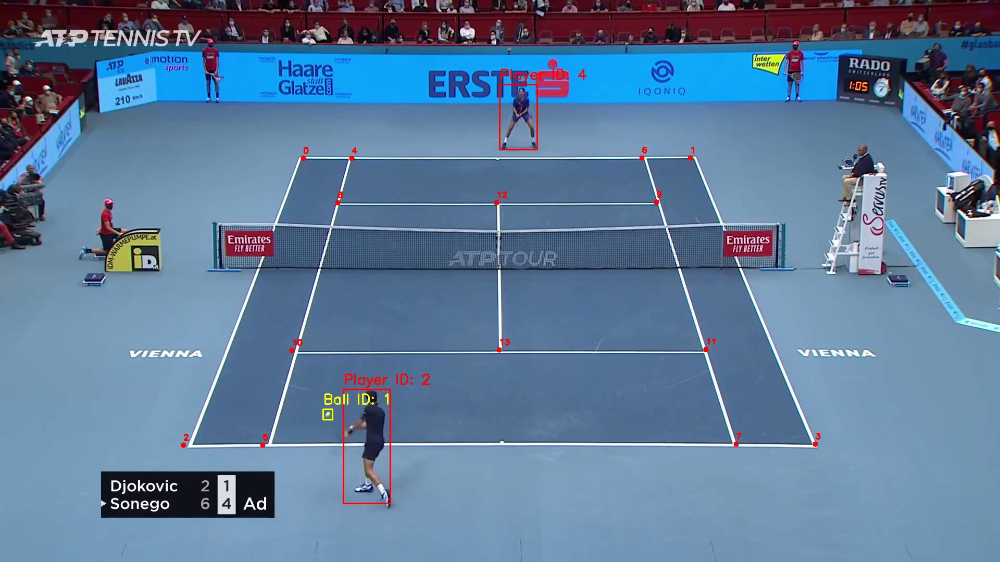

# Tennis Analysis

## Introduction
 In this project, we will build a Tennis Analysis System to detect and track players and the tennis ball. For player detection, we will use a pre-trained YOLOv12 model, while for tennis ball detection, we will fine-tune the YOLOv5 model on a tennis ball dataset from Roboflow. Additionally, we will detect tennis court keypoints by fine-tuning a ResNet50 model on the tennis court keypoints dataset.
To enhance the system, we will implement a player selection and filtering mechanism. Using the detected tennis court keypoints, we will detect the two players closest to the court.

## Output Videos
Here is a screenshot from one of the output videos:

